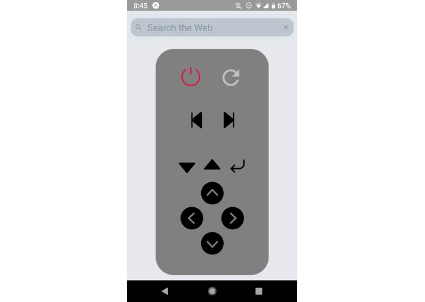

# webmote
A remote control for your web browser!
## Prerequisites
In order for Selenium to create a browser instance, you need to install the 
corresponding driver for it and move it somewhere in your path (`/usr/local/bin/` should be fine)
In this case, I used Firefox so you can download the latest driver [here](https://github.com/mozilla/geckodriver/releases)

Additionally, you will need the expo client mobile app (available on iOS and Android)
and the expo-cli in order to be able to run the app on your device. To install the CLI:
```bash
npm install -g expo-cli
```

After that, clone the repo and install the prerequisites:
```bash
git clone https://github.com/sergeichestakov/webmote.git
cd webmote
npm install
```

At the moment, the app connects to the server which runs on localhost on your machine.
The mobile app has to establish a websocket connection between the two, and so far the
only way to do that is to hardcode the IP address which is a single variable in `screens/HomeScreen.js`.
So run a quick `ipconfig` (or `ifconfig` on Linux) to figure out your local IP address and modify that variable.
I'm currently looking into other ways to establish a connection between devices, 
but that was all I was able to get done at the hackathon.
## Instructions
First, start up the server on your local machine using
```bash
python3 server/serve.py
```
This should open up the browser with some tabs as well.

Next, in a new terminal window, launch the app through the expo client by running
```bash
expo start
```
Now you can open up the Expo app on your phone and scan the QR code to run my app.
## How it works


Taking a look at the screenshot above, we can see there's quite a bit of functionality.
The arrows at the very bottom allow you to scroll (up and down keys) and switch tabs (left and right).

In the row immediately above that, the two smaller arrows allow you to iterate 
through any links (anchor tags) on the current page. It will highlight the one that's currently selected and the "enter" key to the right of them will actually click the link and 
navigate to the URL specified in the href attribute.

The left and right arrows above those simply go back and forward in history respectively.

On the top row, we have a refresh button, which just refreshes the page, and a power button
which closes the browser if it's open and reopens a new browser window if it's closed.
There's even haptic feedback when you press buttons!

Finally, we have a search bar at the very top which allows you to search anything on Google. You can also prefix "goto:" followed by a valid URL to take you directly to any website. (for example `goto:youtube.com` will take you right to Youtube).

## Notes
This has only been tested on Android so far, but it should work the same on iPhones.

This app is still very much in progress as I put it together at a hackathon, however I plan to add more functionality and make it easier to install and distribute.
